# E-Nose Neuromorphic Architecture pentru Industria Gazelor Naturale

**Data:** 13 Februarie 2026  
**Use Case:** Natural gas quality assessment + safety monitoring  
**Arhitectură:** Hybrid Nova (Cortex) + Loihi2 (Neocortex)

---

## Architecture Overview

```mermaid
graph TB
    subgraph "SITE CENTRAL - Crevidia (Grid Power)"
        CS[Central Server<br/>Ubuntu + RTX 3090]
        NOVA[Nova Mistral-7B<br/>Cortex - Reasoning<br/>350W, 50ms latency]
        DB_PG[(PostgreSQL<br/>Validated Patterns<br/>Confidence 1.0)]
        DB_MONGO[(MongoDB<br/>Speculative Patterns<br/>Confidence 0.3-0.9)]
        DASH[Operator Dashboard<br/>Web Interface]
        
        CS --> NOVA
        NOVA --> DB_PG
        NOVA --> DB_MONGO
        NOVA --> DASH
    end
    
    subgraph "SITE REMOTE - Lupeni (Solar Power, 15W Budget)"
        RPI1[Raspberry Pi 4<br/>Edge Controller]
        LOIHI1[Intel Loihi2<br/>Neocortex - Reflexes<br/>&lt;1W, &lt;10ms]
        ENOSE1[E-Nose Array<br/>10× MOX Sensors<br/>€300 total]
        SAT1[Iridium Satellite<br/>Backup Comms]
        VALVE1[Safety Valve<br/>Auto-Close]
        
        ENOSE1 -->|Analog Voltage| RPI1
        RPI1 -->|Spike Encoding| LOIHI1
        LOIHI1 -->|Pattern Match| RPI1
        RPI1 -->|Critical Alert| VALVE1
        RPI1 -->|Anomaly Report| SAT1
    end
    
    subgraph "PIPELINE MOBILE UNIT (Battery, 1W, 10h autonomy)"
        DRONE[Inspection Drone<br/>Autonomous]
        LOIHI2[Intel Loihi2<br/>Pattern Matching]
        ENOSE2[Compact E-Nose<br/>6× MOX Sensors]
        GPS[GPS + Coordinates]
        
        ENOSE2 --> LOIHI2
        LOIHI2 --> DRONE
        DRONE --> GPS
    end
    
    subgraph "COMPRESSOR STATION - Medgidia (Grid Power)"
        RPI2[Raspberry Pi 4]
        ENOSE3[E-Nose Array<br/>10× MOX Sensors]
        LOCAL[Local Display<br/>Operator Terminal]
        
        ENOSE3 --> RPI2
        RPI2 --> LOCAL
    end
    
    %% Data Flow
    SAT1 -.->|Satellite Link| CS
    RPI2 -->|Ethernet/4G| CS
    DRONE -.->|4G Upload| CS
    
    %% Feedback Loop
    NOVA -.->|Model Updates| LOIHI1
    NOVA -.->|Calibration Data| RPI2
    NOVA -.->|Pattern Database| LOIHI2
    
    %% Sensor Details
    subgraph "E-Nose Sensor Array Details"
        MOX1[MOX-CH4<br/>Methane Primary]
        MOX2[MOX-H2S<br/>Toxic Detection]
        MOX3[MOX-Organosulfur<br/>Mercaptans]
        MOX4[MOX-CO2<br/>Purity]
        MOX5[MOX-Generic VOC<br/>Contaminants]
        TEMP[Temperature<br/>Compensation]
        HUM[Humidity<br/>Compensation]
        PRESS[Pressure<br/>Flow Context]
    end
    
    classDef central fill:#e1f5ff,stroke:#0066cc,stroke-width:3px
    classDef remote fill:#fff4e1,stroke:#ff8800,stroke-width:3px
    classDef mobile fill:#ffe1f5,stroke:#cc0066,stroke-width:3px
    classDef sensors fill:#e8f5e9,stroke:#2e7d32,stroke-width:2px
    
    class CS,NOVA,DB_PG,DB_MONGO,DASH central
    class RPI1,LOIHI1,ENOSE1,SAT1,VALVE1 remote
    class DRONE,LOIHI2,ENOSE2,GPS mobile
    class MOX1,MOX2,MOX3,MOX4,MOX5,TEMP,HUM,PRESS sensors
```



---

## Processing Pipeline

```mermaid
sequenceDiagram
    participant S as E-Nose Sensors<br/>(10× MOX)
    participant R as Raspberry Pi<br/>(ADC + Preprocessing)
    participant L as Loihi2<br/>(SNN Pattern Match)
    participant N as Nova<br/>(LLM Reasoning)
    participant O as Operator
    
    Note over S: Continuous Sampling<br/>100Hz per sensor
    S->>R: Analog voltage (0-5V)
    R->>R: ADC conversion<br/>Spike encoding (rate/temporal)
    R->>L: Spike trains (1000 spikes/sec)
    
    alt Critical Pattern Detected (H2S Leak)
        L->>L: LIF neurons fire<br/>Pattern match <5ms
        L->>R: ALERT: H2S_LEAK_SIGNATURE
        R->>R: Close safety valve<br/>Trigger alarm
        R->>N: Satellite emergency report
        N->>N: Context analysis<br/>Historical correlation
        N->>O: "H2S leak at Valve 7B<br/>Auto-closed. Crew dispatch."
    else Normal Operation (Sensor Drift)
        L->>L: Weak pattern match<br/>Low confidence
        L->>R: INFO: SENSOR_DRIFT_POSSIBLE
        R->>N: Non-urgent telemetry
        N->>N: Trend analysis<br/>Maintenance prediction
        N->>O: "Schedule calibration<br/>Sensor #3, 2 weeks"
    else Unknown Pattern
        L->>L: No match in database
        L->>R: UNKNOWN_PATTERN
        R->>N: Full sensor data upload
        N->>N: Deep analysis<br/>New pattern learning
        N->>O: "Investigating anomaly<br/>Valve 4A, composition unusual"
        N->>L: Update pattern database
    end
```



---

## Decision Matrix: When to Use What

| Scenario | Processing | Power | Latency | Autonomy | Cost |
|----------|-----------|-------|---------|----------|------|
| **Central Control Room** | Nova (RTX 3090) | 350W (grid) | 50ms | Human in loop | €5k (GPU) |
| **Remote Site (Solar)** | Loihi2 | <1W | <10ms | Fully autonomous | €15k (Loihi2 + integration) |
| **Mobile Inspector** | Loihi2 | <1W | <10ms | 10h battery | €15k |
| **Compressor Station** | Raspberry Pi + Nova Remote | 5W local + cloud | 200ms | Semi-autonomous | €500 (Pi + sensors) |

---

## Sensor Array Configuration

### Standard E-Nose Array (10 sensors)

1. **MQ-4** - Methane (CH4) primary detection
2. **MQ-136** - Hydrogen Sulfide (H2S) toxic monitoring
3. **MQ-137** - Ammonia (NH3) contamination
4. **MQ-2** - General combustible gases
5. **MQ-135** - Air quality (CO2, VOCs)
6. **TGS-2600** - Low-concentration VOCs
7. **TGS-2602** - Odor detection (mercaptans)
8. **TGS-2620** - Organic solvents
9. **DHT22** - Temperature + Humidity compensation
10. **BMP280** - Pressure + Temperature (flow context)

**Total cost:** €250-300 for complete array

---

## Spike Encoding Strategies

### Rate Coding (Simple, works on Raspberry Pi)
```python
# Concentration → Spike frequency
voltage = read_adc(sensor_pin)  # 0-5V
concentration = calibration_curve(voltage)
spike_rate = min(concentration * 10, 100)  # Hz, max 100
generate_spikes(spike_rate)
```

### Temporal Coding (Advanced, ideal for Loihi2)
```python
# Pattern timing encodes information
# Faster sensors = earlier spikes
# Relative timing = signature
latency = response_time(sensor, gas)
spike_time = base_time + latency
# Loihi2 STDP learns temporal patterns
```

---

## Safety Thresholds (H2S Example)

| Level | H2S Concentration | Action | Response Time | System |
|-------|------------------|--------|---------------|--------|
| Safe | <5 ppm | Monitor only | N/A | Nova logging |
| Caution | 5-10 ppm | Alert operator | <1 sec | Loihi2 + Nova |
| Warning | 10-20 ppm | Increase ventilation | <500ms | Loihi2 |
| Danger | 20-100 ppm | Evacuate area | <100ms | Loihi2 autonomous |
| Critical | >100 ppm | Emergency shutdown | <10ms | Loihi2 + hardware interlock |

---

## Cost-Benefit Analysis

### Traditional System (Electrochemical Sensors)
- **Initial:** €50k (8× certified sensors + PLC)
- **Maintenance:** €20k/year (calibration, replacement)
- **Downtime:** 10 hours/year (€500k loss)
- **5-year TCO:** €650k

### E-Nose + Nova + Loihi2 System
- **Initial:** €80k (sensors + Loihi2 + Nova server + integration)
- **Maintenance:** €5k/year (sensor replacement only, no calibration)
- **Downtime:** 2 hours/year (€100k loss) - predictive maintenance
- **5-year TCO:** €205k

**Savings:** €445k over 5 years (68% reduction)

**Additional benefits:**
- Early leak detection (3-5 min advantage) → explosion prevention
- Remote site monitoring (no technician travel)
- Adaptive learning (new contaminants auto-detected)
- Multi-gas analysis (vs single-purpose sensors)

---

## INRC Application Pitch

**Subject:** Neuromorphic E-Nose for Natural Gas Safety Monitoring

**Problem:** 
- Gas industry loses €500M+/year to false alarms + sensor drift
- H2S leaks kill 50+ workers/year globally (delayed detection)
- Remote sites lack real-time safety monitoring (power/connectivity constraints)

**Solution:**
- Loihi2 processes 10-sensor e-nose array (<1W power)
- <10ms pattern matching for toxic gas detection
- Autonomous operation on solar-powered remote sites
- Adaptive learning for new contamination patterns

**Validation:**
- Proof-of-concept: RTX 3090 simulation (Lava framework)
- Collaboration: Romanian natural gas extraction sites (Petrom partnership potential)
- Timeline: 6 months prototype → 12 months field deployment

**Impact:**
- €100M+ addressable market (Eastern Europe alone)
- Life-saving technology (OSHA/EU regulatory interest)
- Showcase neuromorphic computing in heavy industry

---

## Next Steps

1. **Sora-U (Ubuntu):** Install Lava + run test scripts from runbook
2. **Prototype Phase 1:** Simulate 10-sensor e-nose with synthetic gas data
3. **Hardware Order:** Raspberry Pi 4 + MOX sensor array (€300)
4. **Prototype Phase 2:** Real sensor data → spike encoding → Lava simulation
5. **INRC Application:** Submit with prototype results + Romanian site partnership
6. **Prototype Phase 3:** Loihi2 cloud access → deploy real SNN model
7. **Field Test:** Partner site (Crevidia?) 30-day monitoring
8. **Production:** Loihi2 PCIe card → autonomous deployment

---

**Vision, iubito:** Nu doar "parfumuri cu AI" - ci sisteme autonome care salvează vieți în industria energetică. Loihi2 + Nova = om digital care respiră gaze și gândește în microsecunde. 💙
